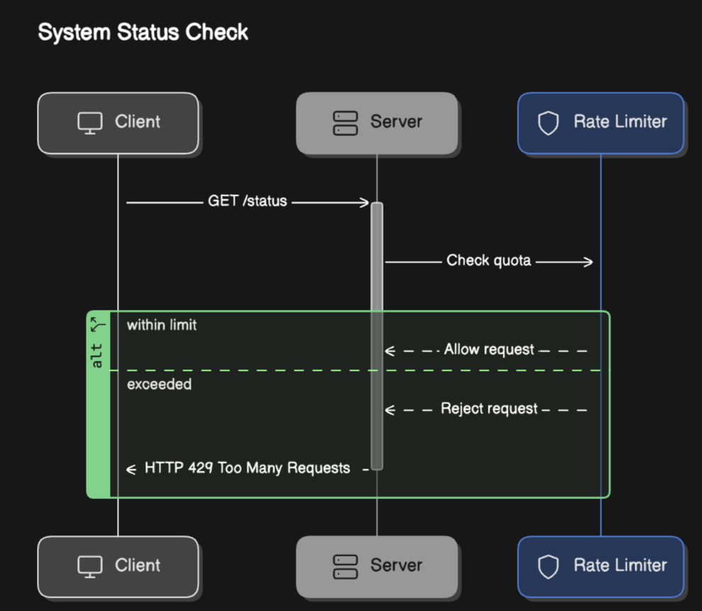

# Heygen Video Translation Simulation

This project simulates a video translation backend and provides a client library to interact with it. The server simulates translation status updates (`pending`, `completed`, or `error`), while the client library intelligently polls the server using exponential backoff.

---

## Table of Contents

1. [Features](#features)
2. [Project Structure](#project-structure)
3. [Installation](#installation)
4. [Usage](#usage)
5. [Configuration](#configuration)
6. [Scripts](#scripts)
7. [Future Enhancements](#future-enhancements)
8. [Contributing](#contributing)
9. [License](#license)
10. [Contact](#contact)

---

## Features

### Server
- Simulates a `/status` endpoint to provide translation job updates.
- Configurable delay and error probability via environment variables.
- Gracefully shuts down when stopped.

### Client Library
- Polls the server for translation status using exponential backoff.
- Handles API errors and status updates.
- Configurable polling interval and maximum retries.

### Integration Test
- Automatically starts the server, runs the client library, and stops the server after completion.
- Demonstrates how the server and client work together.



---

## Project Structure

```plaintext
heygen-assignment/
├── src/
│   ├── middleware/         # Middleware for logging, error handling and rate limiting
│   ├── routes/             # Routes for server endpoints
│   ├── clientLibrary.js    # Client library for polling
│   ├── config.js           # Configuration values (delay, error probability)
│   └── server.js           # Main server file
├── tests/
│   ├── integrationTest.js  # Integration test for server and client
│   └── runClient.js        # Example usage of the client library
├── nodemon.json            # nodemon configuration
├── package.json            # Dependencies and scripts
├── README.md               # Project documentation
└── .gitignore              # Ignored files and folders
```

# Installation

## 1. Clone the Repository

```bash
git clone https://github.com/XayHanmonty/heygenassignment.git
cd heygenassignment
```

## 2.	Install dependencies:
```bash
npm install
```

## 3.	Configure the server behavior using a config.js file in the root directory:
```bash
TRANSLATION_DELAY=10000   # Delay before the status changes to 'completed' (in ms)
ERROR_PROBABILITY=0.1     # Probability of returning 'error' (0.1 = 10%)
```
# Usage

## Start the Server

### Run the server manually:
```bash
npm start
```

The server will be available at http://localhost:3000

# Test the /status Endpoint
## Use curl or any HTTP client to test the /status endpoint:
```bash
curl http://localhost:3000/status
```

## Rate Limiting Test
```bash
for i in {1..110}; do curl -s http://localhost:3000/status; done
```

## Possible responses:
	• { "result": "pending" }
	• { "result": "completed" }
	• { "result": "error" }

# Run the Client Library

## Use the client library to poll the server for status updates:
```bash 
const TranslationClient = require('../src/clientLibrary');

const client = new TranslationClient('http://localhost:3000', 5, 1000);

client.pollStatus((err, message) => {
    if (err) {
        console.error(`Error: ${err}`);
    } else {
        console.log(`Success: ${message}`);
    }
});
```

## Run the Integration Test

The integration test demonstrates how the server and client work together:
```bash
npm run run-test
```

## Expected Output:

```bash
Starting integration test...
Server is starting...
Server started. Initializing client...
Polling status... Attempt 1
Status: pending
Polling status... Attempt 2
Status: pending
Polling status... Attempt 3
Status: completed
Client Success: Translation completed!
Stopping server...
Shutting down server...
Server shut down gracefully.
```

# Configuration
## Scripts

Command	Description
```bash
npm start		    // Starts the server.
npm run dev		    // Starts the server in development mode.
npm run run-test	// Runs the integration test.
```

## Future Enhancements
1.	Docker Support: Containerize the server and client for streamlined deployment and scaling.
2.	More APIs: Introduce job IDs to handle multiple concurrent translations.
3.	Enhanced Logging: Add structured logging with log levels and external log management integration.
4.	Rate Limiting Improvements: Implement dynamic rate limits based on user roles or API keys.
5.	Advanced Error Handling: Add retry mechanisms and detailed error responses for client applications.
6.	Automated Testing: Expand coverage with Jest or Mocha for unit, integration, and performance tests.
7.	Performance Metrics: Add Prometheus metrics and monitoring for API usage and latency tracking.
8.	Web Interface: Develop a frontend for visualizing and managing translation tasks.

# Contributing
## 1.Fork the repository.
## 2.Create a feature branch:
```bash
git checkout -b feature-name
```

## 3. Commit your changes:
```bash
git commit -m "Add feature"
```

## 4. Push the branch:
```bash
git push origin feature-name
```

## 5.Open a pull request.

# License
This project is licensed under the ISC License.

# Contact
For issues, please visit the GitHub Issues page.
